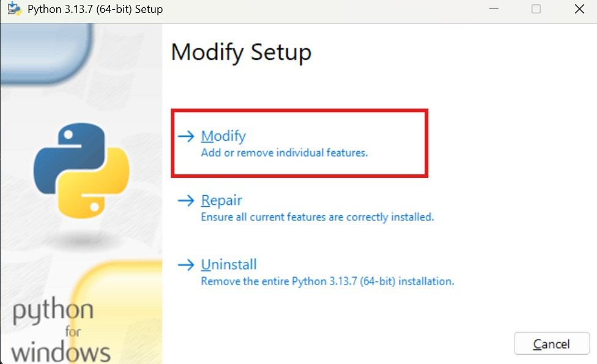
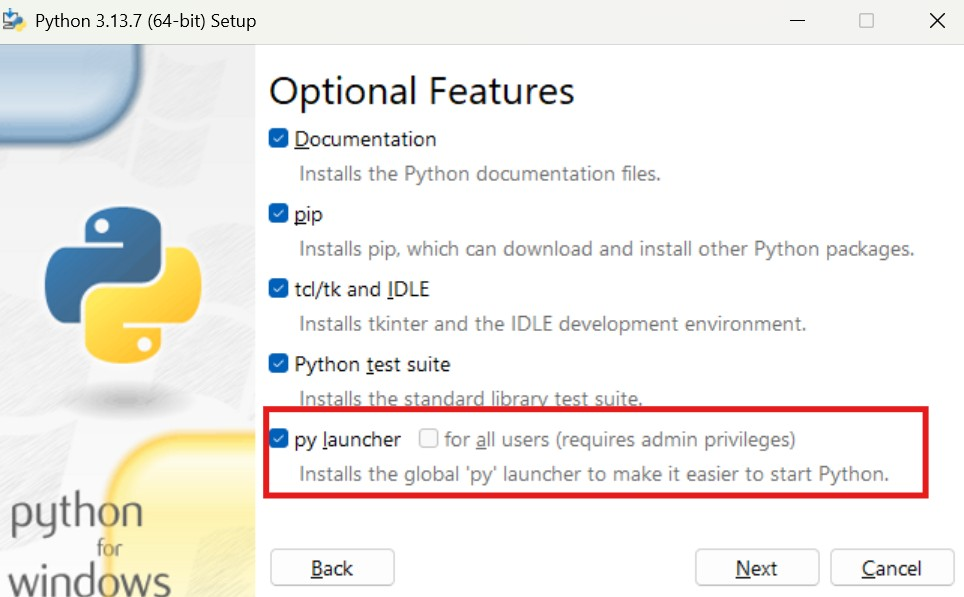
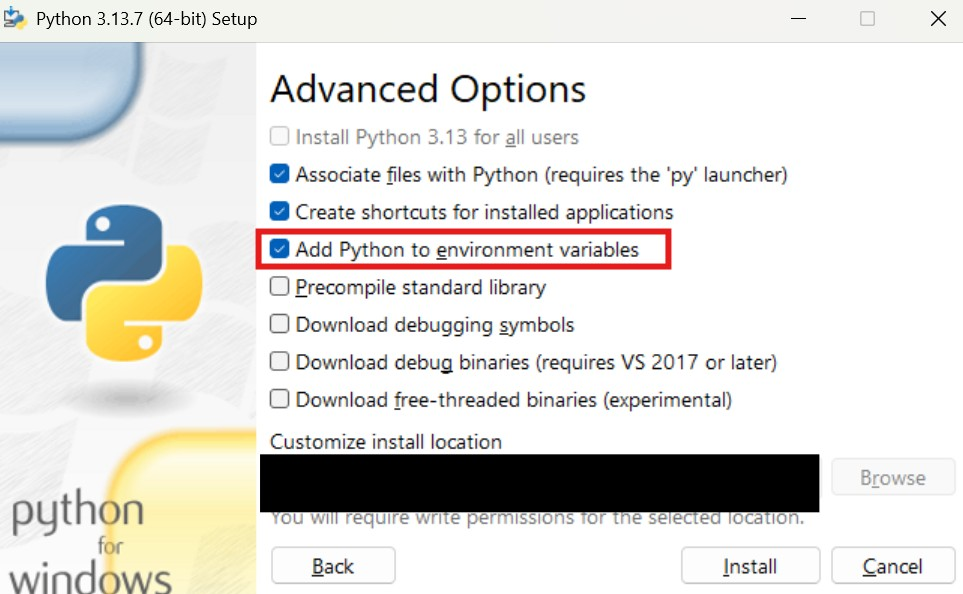
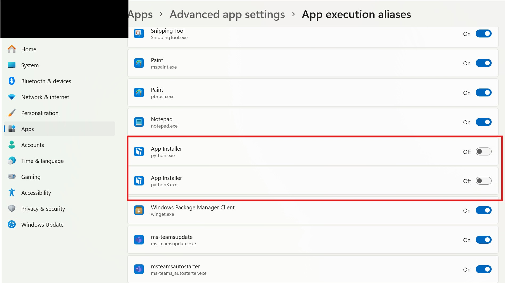
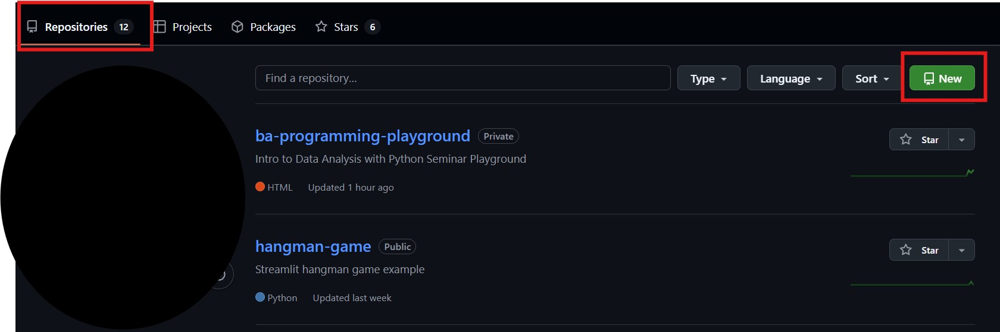
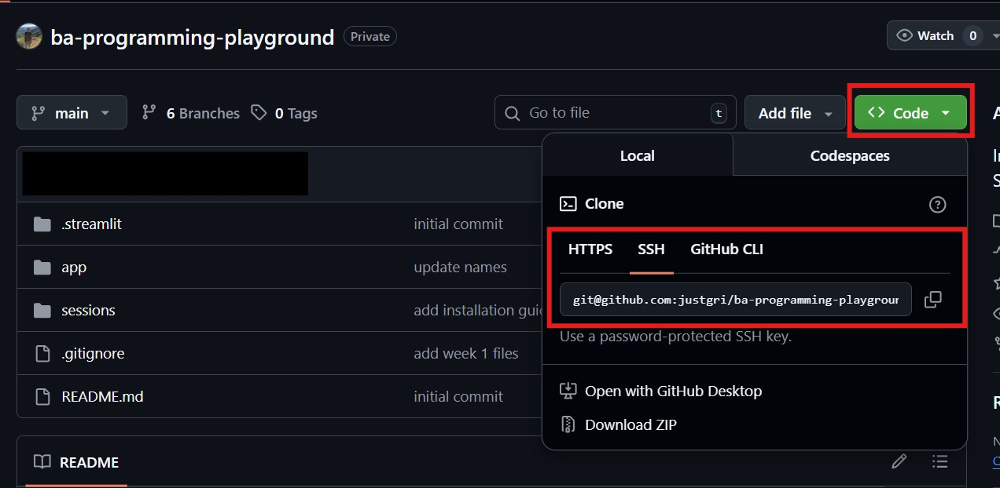
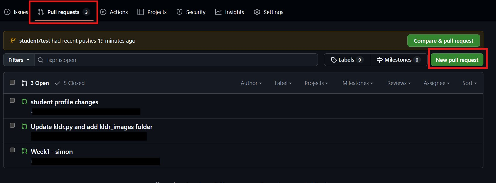
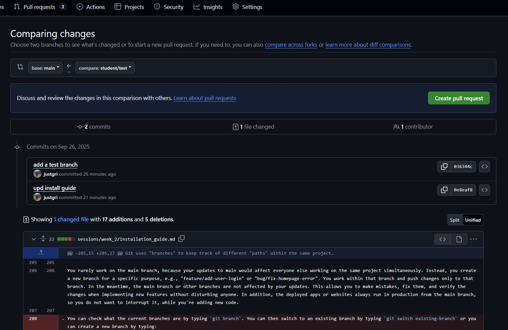
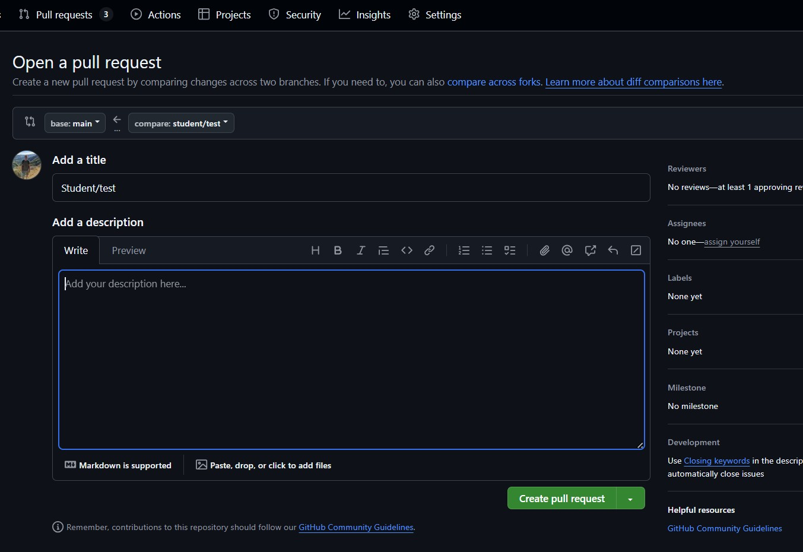

# **Week 2 - Installation Guide**
## **Python, VS Code, Git, and GitHub**

I organize this file into separate "Checkpoints". They follow an intuitive flow and are mostly interdependent. Even if you don't get through all of them, try to make as much progress as possible within the suggested amount of time, and let me know about your progress as soon as possible. I'm happy to help via email or hop on Zoom to help you get past this smoothly.

### **Terminal / Command Line Interface** 
When I use the word "terminal", it refers to "Command Line Interface" (CLI), which can be found as "Terminal" in macOS and "PowerShell" in Windows. Both OS can also open terminals within VS Code (more on that below). In YouTube tutorials related to Git, you might also see *Git Bash* being used. All these CLI-looking tools share some commands and functionality, but they are not equivalent.

The two main CLI commands for this tutorial are
* *pwd* to print working directory
* *cd* to change directory
* *ls* to list files in the directory

All commands entered in CLI will perform that action within the current working directory. You can open a new terminal from any folder by right clicking on folder and choosing "Open in Terminal" for Windows or "New Terminal at Folder" for macOS. Or you can copy the folder path and enter `cd folder_path` to navigate to that folder within an already opened terminal. 

# **Checkpoint 1 - Installation (1 hour)**
Most of you already have these things running successfully. The main issue was for Windows users who had to use `py -m pip install` - if that's you, please read part 1A carefully. That will resolve issues with VS Code kernel as well. 

## **1A - Python**

By now you should all have Python installed. You can verify that you have installed both successfully in terminal. The defaults on my laptops were:

* For Windows: `pip --version` or `python --version`
* For macOS `pip --version` or `python3 --version`

For those Windows who can only check Python version with `py -m pip --version` or `py --version`, you will need to rerun python.exe file from [www.python.org/downloads/](https://www.python.org/downloads/) (apologies for my oversight). You do not need to uninstall and reinstall. It is enough rerun the file "python-3.13.7-amd64.exe" and choose *Modify*, instead. Then follow the three screenshots below.

If after these steps you still can't verify the Python version with `pip --version`, then go to Windows System Settings -> Apps -> Advanced app settings -> App execution aliases (just search "App execution aliases" from Windows+S) and **untoggle** the two Python Apps. 

<div style="display:flex; gap:8px; align-items:flex-start;">
  
  
</div>

<div style="display:flex; gap:8px; align-items:flex-start; margin-top:8px;">
  
  
</div>


## **1B - Visual Studio (VS) Code**

Download and install VS Code from https://code.visualstudio.com/download. Verify installation with `code --version` in the terminal. 

## **Python and Jupyter extensions in VS Code**
After you open any Jupyter Notebook file (.ipynb) in VS Code and try runnning a cell with Shift+Enter, you will be asked to install *Python* and *Jupyter* extensions. Click yes.

## **Kernel**

When the extensions are installed and you run a cell again, it should automatically trigger a question if you want to install *ipykernel*. Click Yes and wait for installation to finish. If you do not get that message, run the command `pip install ipykernel` in terminal, close and reopen VS Code, and try running a cell again.

## **Opening VS Code**
An easy way to open VS Code from terminal is by entering `code`. You can also open an entire folder with VS Code by navigating to your work folder with all course documents using *cd* (e.g., I type `cd C:\Users\my_user_name\Documents\Git\ba-programming-playground`) in terminal and then enter `code .` (the dot opens the folder in VS Code). 

## **Terminal within VS Code**
You can open terminal in VS Code with Ctrl+Shift+P → “Python: Create Terminal" (or Cmd+Shift+P for macOS) or keybord shortcut "Ctrl+Shift+`". It is the exact same terminal as your macOS terminal or Windows PowerShell. We can use it within VS Code for convenience.

## **AI Copilot**
After opening VS Code, you might be asked whether you want to connect VS Code to GitHub, which also automatically enables *GitHub Copilot*. Copilot is an AI code autocomplete tool that gives code and text autocomplete suggestions real-time as. I tried working with it for 1-2 weeks and it seems incredible at first, but it is actually very distracting, leads to mistakes, and disturbs the coding process. Just imagine if with each typed word in a Word doc, you would get an entire paragraph of text generated for you - it sounds amazing, but it will not convey your thoughts exactly as you want and you will get distracted a lot. We will try it out in sessions 5 or 6, but for now, I would highly encourage to disable it.

In VS Code, click `Ctrl+Shift+P` (`Cmd+Shift+P` for macOS) and search for `GitHub Copilot: Toggle (Enable/Disable) Completions`. Click on it to enable/disable Copilot.

## **1C - Python packages**
We will need to install third-party packages for many additional Python functions, e.g., the main ones are *pandas*, *numpy*, *matplotlib*, *streamlit*, *statsmodels*, etc. You can do that with terminal by typing `pip install package-name`, e.g., `pip install pandas`, `pip install numpy`, etc.

Try installing the ones mentioned above, since we will definitely use them in the next few weeks. After a successful installation, you can check the version of installed packages by typing it in Jupyter Notebook and running cell.

```python
import pandas as pd
import numpy as np
print(pd.__version__)
print(np.__version__)
```
If these packages are installed and imported successfully, you can use them in your code. Note that you will have to run the imports once each time you reopen VS Code. Import statements should always be all in one place at the very top of your code. Try running this:

```python
my_array = np.array([1,2,3,4])
average = np.mean(my_array)
print(average) # should print 2.5
```

<div class="page-break"></div>

# **Checkpoint 2 - Git and GitHub Setup (1 hour)**
Please watch this video first to get a general sense of what is Git and how it is used: https://www.youtube.com/watch?v=mJ-qvsxPHpY.

Git is the universal *version control* tool, used by most programmers. You should use Git for any programming project going forward. Git does not equal to GitHub or GitLab. Git is a local tool, while GitHub and GitLab are websites built around Git, but they add a lot more functionality, allow collaboration between users, host repositories online, has a web interface, integrates with other tools (e.g., deploying apps to the server), etc. We will use GitHub for our course, but the two are equally powerful.

* For macOS, when you run the first Git command, it will prompt you to install Git, click *Install* then. If it's not working, type `xcode-select --install`.
* For Windows, download and install from https://git-scm.com/downloads. Verify successful installation in termainal with `git --version`.

You should also have a GitHub account with email and user name. Use those in Git config below

## **2A - Setup Git config**
Run this line-by-line in terminal with user name and email used for GitHub account.
```
git config --global user.name "user"
git config --global user.email "you@university.ch"
git config --global init.defaultBranch main
```

## **2B - Connect your device to GitHub account with SSH**

We connect our local device to our GitHub account through SSH key. Watch this 2 min video to see how it looks: https://www.youtube.com/watch?v=X40b9x9BFGo. There are longer videos if you search "how to connect to GitHub with SSH", but they often overcomplicate things.

Start by generating a new SSH key. You can use your regular terminal to generate SSH key, it doesn't have to be Git Bash.

`ssh-keygen -t ed25519 -C "your_email@example.com"`

I do not use a passphrase on my personal laptop (i.e., leave it empty). I think it is ok (*not an official adivce*), unless you are sharing your laptop with other people. If your laptop gets stolen or hacked, you will probably have bigger concerns than worrying about someone pushing or pulling files to your GitHub.
Otherwise, you have to enter that phrase each time you pull files from GitHub. There are ways to cache the pass phrase, so that you only need to enter it once in a while, if you prefer higher security with more convenience. All that said, DO NOT share the *private* SSH key with anyone, DO NOT write it down in code, DO NOT save it on shared repositories, and generally DO NOT upload it anywhere (including ChatGPT).

Once you generate the SSH key, go to that folder, e.g., for me on Windows it's `C:\Users\my_name\.ssh`. Then open the *public* (.pub) key file in a text editor, copy the key, and add it to your GitHub account in Settings -> SSH and GPG keys -> New SSH key. Once you add it, you should get an email confirmation from GitHub. Test in terminal whether connection was successful with:

`ssh -T git@github.com`

You should see something like *Hi your_name! You've successfully authenticated, but GitHub does not provide shell access.*

## **2C - Clone course repo to your local device**
You can now clone ("download") the course repo to your local device. Using terminal, navigate to a folder where you want the repo to be downloaded (again, use "*cd PATH*" for that). Then enter:

`git clone git@github.com:justgri/ba-programming-playground.git`

You should see a new folder created on your device. Enter that folder in terminal with `cd ba-programming-playground` and verify whether it is connected to the remote (online) repo by entering `git status`. You should say:

```
On branch main
Your branch is up to date with 'origin/main'
```

Verify that you see all the files I showed in class. From now on, you can easily pull all new course files by typing `git pull` in terminal, opened from anywhere inside that folder.

<div class="page-break"></div>

# **Checkpoint 3 - Create and make changes to your own private repo (1 hour)**

You should have already watched this video: https://www.youtube.com/watch?v=mJ-qvsxPHpY.

Now let's try following this video to create your own private repo. There are two main ways you can do it:
1. Create a new folder on your device, run `git init`, then add remote and push it to your GitHub account.
2. Create a new remote repo on the web interface and `git clone` it to your local device.

I think #2 is easier, so I recommend starting with that.

## **3A - Create a new private remote repo and clone it to your device**



After you click New, ener a name and short description. Make it **PRIVATE**, Add README, Add .gitignore, and Add MIT license.

Now in the new repo, find the SSH link.



Copy this code and use it clone this repo to your local device, similar to how you cloned the course repo. Navigate to the folder where you want it cloned to, open the terminal, and type `git clone git@github.com:user.name/your-new-repo.git`. Check whether this new repo is now cloned to your local device.

## **3B - Make local changes and push to your remote repo**

Try adding new files (e.g., test.txt or test.py) locally in that folder and type `git status` in the terminal opened from that folder. You should see these new files appearing under "Untracked files". That's great news - Git recognizes that you added or modified files.

Then we will follow the most frequent sequence, used to sync your local changes to the remote (GitHub) repo.

```
git pull
git add -A
git commit -m "short commit message about the changes"
git push
```

`git pull` makes sure that you have the most recent version of the. It doesn't overwrite your changes. If there are conflicts (e.g., someone made different changes to *the same lines in the same file* as you did), then these conflicts will be raised and you will have to resolve them in VS Code merge editor. That should never happen in your private repo. We will see how to deal with that in collaborative projects in the last session.

`git add -A` adds all the files that were modified (including deletions and new files) to staging phase. If you want to stage just one file, specify it with, e.g., `git add test.py`.

`git commit -m "commit message"` commits your staged changes (all that were previously added with `add` but not yet commited) and saves the staged version of your repo locally. Write a concise meaningful commit message.

`git push` is what actually pushes your local commits to the remote GitHub repo. It will push all commits created locally since the last push. When you push to the repo for the first time, add this `git push -u origin main`.

You don't always have to run all these commands immediately one after another, and you can always type `git status` to see what has been modified, staged, and committed at any given point since last push.

## **3C - Initialize a new local repo and push to remote**

This is a bonus "FYI" point. We won't use this in the course, but it is also possible to create new remote (GitHub) repos without first initializing them on the website. You would follow these steps in the terminal from a folder that you want to use to create a remote repo.

```
git init

git remote add origin git@github.com:username/new-repo-name.git

git pull --rebase origin main

git push -u origin main
```

<div class="page-break"></div>

# **Checkpoint 4 - New branch in your private and course repo (1.5 hour)**

Now that you completed Checkpoints 2 and 3, you should:

* From CP2: have the ba-programming-playground repo cloned to your local device (check if it's up-to-date with `git pull`) 
* From CP3: generally understand how to pull updates from a remote repo to your local device and how to push your local updates to a remote repo.

Then it's always a good time to start learning how to collaborate on programming projects with other people, since you will almost never work alone. If you only worked alone, you might be fine without using Git at all and do "version control" in the good old "final_project_v4_draft_last_09_26.py" way. :&#8203;)

## **4A - Git branch**

Git uses "branches" to keep track of different "paths" within the same project. There is always the "main" branch that holds the project together.


You rarely work on the main branch, because your updates to main would affect everyone else working on the same project simultaneously. Instead, you create a new branch for a specific purpose, e.g., "feature/add-user-login" or "bug/fix-homepage-error". You work within that branch and push changes only to that branch. In the meantime, the main branch or other branches are not affected by your updates. This allows you to make mistakes, fix them, and verify the changes when implementing new features without disturbing anyone. In addition, the deployed apps or websites always run in production from the main branch, so you do not want to interrupt it, while you're adding new code.

### **Try this in your private repo**

You can check what branch you are on and what other branches exist on the repo by typing `git branch`. You can then switch to an existing branch by typing `git switch existing-branch` or you can create and switch to a new branch by typing `git switch -c new-branch`. The new-branch is created only locally and and will be available remotely as soon as you push some changes to it. You can do that with the regular `add`, `commit`, and `push`, with a minor difference in `git push -u origin new-branch`:

```
git add -A
git commit -m "updates on a new feature"
git push -u origin new-branch
```

You can then continue workin on updates, add, commit, and push to that new branch for as long and as often as you want. Once you have completed some specific task and you want the updates to appear in the main, you have to *merge* your branch into the main branch by doing the following:

```
git switch main
git pull
git merge your-branch
```

Don't be scared - when you do this, switch to main and pull, all your changes seem to disappear - that's normal, because you go back to the main branch content, while your changes are saved in your separate branch! As soon as you do `git merge your-branch`, the changes from your separate branch are merged into the main (assuming there were no conflicts). You can always go back to your branch by typing `git switch your-branch` to make more updates before merging and you can type `git branch` if you forgot the name of your branch.

## **4B - Pull Requests**

For the purpose of this project (as is in most software projects), the main branch is also protected, i.e., you cannot freely merge your branch into the main branch from your terminal. You usually need someone else (in this case me) to review updates from your branch before merging to verify that there are no conflicts or to resolve conflicts if there are any, and then confirm that merge. This is done by creating a Pull Request (PR) in the GitHub web interface. It means that you are asking to pull (=merge) changes from one branch into another.



A Pull Request (PR) is a more involved process than just `git merge`, which simplifies project management a lot. With a PR you can have guardrails such as requiring multiple people to review the changes, leave comments about specific changes, go back-and-forth between reviewers, and ask the person who created a PR to make more changes. That's how regular life works on any project - GitHub just creates a convenient structured interface for that.

When you click "New Pull Request" you will see the screen below. The interface is intuitive, but it's most important to note that you are requesting to pull updates from **"compare"** branch into the **"base"** branch, not the other way around. Before creating a PR, you can review what commits you made, which files were modified/added/deleted, and who made these updates.



Once you click "Create pull request" you will see the screen below. You should edit the title, but keep it short (e.g., merging week 2 updates from student/test into main). However, you should add a few more details in the description.




Once you click "Create pull request" on this last screen, your PR will be published and other people will be able to view it. Then the reviewer (me) will review the changes, add comments and request changes if necessary or approve directly. The "compare" branch will then be merged into the "base" branch as specified in the PR.

# **Checkpoint 5 - Congratulations**
Both to me for writing this and to you for reading and completing it all!

I want you to know that this technical setup is hard and it sets you apart from many beginner programmers who learn how to use Python/R/Stata and do some data analysis, but never take time to learn a proper version control flow. If you work in the industry or on larger research projects, you will most likely have to learn this very well, so better practice in advance. It's also a relevant skill to mention in interviews and CV, and having public projects on GitHub is the starting point for showcasing your coding skills to hiring managers. 

This also teaches you more fundamental skills on how to structure your project, how to plan your work in well-defined steps, save your work with comments along the way, and efficiently collaborate with other people.

I will share this guide in our GitHub repo, so you can also make changes to it and submitting a PR with the updates. For example, it would be good to know what took you longer than expected, what other issues you encountered, what online videos/tutorials were most helpful for you, etc. In that way, we can help future generations to go through it with less pain. :&#8203;)


